# Terminology System Data Model - Final Documentation

## Entity Relationship Diagram

```mermaid
erDiagram
    User ||--o{ Comment : "creates"
    User ||--o{ Favorite : "adds"
    
    Language ||--o{ TermVersionTranslation : "used in"
    Language ||--o{ CategoryTranslation : "used in"
    Language ||--o{ LabelTranslation : "used in"
    
    Category ||--o{ Term : "categorizes"
    Category ||--o{ CategoryTranslation : "has translations"
    CategoryTranslation }o--|| Language : "in language"
    
    Label ||--o{ LabelTranslation : "has translations"
    LabelTranslation }o--|| Language : "in language"
    
    Term ||--o{ TermVersion : "has versions"
    Term ||--o| TermVersion : "has active version"
    Term ||--o{ Comment : "has comments"
    Term ||--o{ Favorite : "favorited by"
    Term }|--o{ TermLabel : "has"
    
    TermVersion ||--o{ TermVersionTranslation : "has translations"
    TermVersionTranslation }o--|| Language : "in language"
    
    Label }|--o{ TermLabel : "applied to"
    Comment ||--o{ Comment : "has replies"
    
    Language {
        int id "Unique identifier for the language"
        string code "ISO code (e.g., 'lv', 'en')"
        string name "Language name"
        boolean isDefault "Is default language"
        boolean isEnabled "Is language enabled"
    }
    
    User {
        int id "Unique identifier for the user"
        string email "Unique email address for authentication"
        string fullName "User's full display name"
        boolean isAdmin "Admin privileges flag"
        boolean isDisabled "Account status flag"
        string preferences "JSON string storing user preferences including language settings"
        datetime createdAt "When the user account was created"
        datetime updatedAt "When the user account was last updated"
    }
    
    Category {
        int id "Unique identifier for the category"
        datetime createdAt "When the category was created"
    }
    
    CategoryTranslation {
        int categoryId FK "References the category"
        int languageId FK "References the language of this translation"
        string name "Translated category name"
    }
    
    Label {
        int id "Unique identifier for the label"
        datetime createdAt "When the label was created"
    }
    
    LabelTranslation {
        int labelId FK "References the label"
        int languageId FK "References the language of this translation"
        string name "Translated label name"
    }
    
    TermLabel {
        int termId FK "References the term"
        int labelId FK "References the label"
        datetime createdAt "When the label was applied to the term"
    }
    
    Term {
        int id "Unique identifier for the term"
        string identifier "Stable identifier across all versions"
        int activeVersionId FK "References the current active version"
        int categoryId FK "References the category this term belongs to"
        datetime createdAt "When the term was created"
    }
    
    TermVersion {
        int id "Unique identifier for the term version"
        enum status "Status: DRAFT, PUBLISHED, or ARCHIVED"
        int versionNumber "Sequential version number"
        boolean readyToPublish "Flag indicating if draft is ready for publishing"
        datetime createdAt "When this version was created"
        datetime publishedAt "When this version was published (nullable)"
        datetime archivedAt "When this version was archived (nullable)"
        int termId FK "References the parent term"
    }
    
    TermVersionTranslation {
        int termVersionId FK "References the term version"
        int languageId FK "References the language of this translation"
        string name "Translated term name"
        string description "Translated term description"
    }
    
    Comment {
        int id "Unique identifier for the comment"
        string content "Comment text content"
        boolean isClosed "Flag indicating if comment thread is closed"
        boolean isDeleted "Soft delete flag"
        int termId FK "References the term this comment belongs to"
        int userId FK "References the user who created the comment"
        int parentCommentId FK "References parent comment for replies (nullable)"
        datetime createdAt "When the comment was created"
        datetime updatedAt "When the comment was last updated"
    }
    
    Favorite {
        int id "Unique identifier for the favorite entry"
        int termId FK "References the favorited term"
        int userId FK "References the user who favorited the term"
        datetime createdAt "When the term was favorited"
    }
```



## Detailed Entity Descriptions

### Language
Stores available languages for the system.

| Field | Type | Description |
|-------|------|-------------|
| id | int | Primary key, unique identifier for the language |
| code | string | ISO language code (e.g., 'lv', 'en', 'de') |
| name | string | Human-readable language name |
| isDefault | boolean | Flag indicating if this is the default fallback language |
| isEnabled | boolean | Flag indicating if the language is currently active |

### User
Stores user accounts and preferences.

| Field | Type | Description |
|-------|------|-------------|
| id | int | Primary key, unique identifier for the user |
| email | string | Unique email address used for authentication |
| fullName | string | User's full display name |
| isAdmin | boolean | Flag indicating if user has administrative privileges |
| isDisabled | boolean | Flag indicating if the account is disabled |
| preferences | string | JSON string storing user preferences including: <br>- UI language preference<br>- Terms language preference<br>- Other configurable settings |
| createdAt | datetime | Timestamp when the user account was created |
| updatedAt | datetime | Timestamp when the user account was last updated |

### Category
Primary classification for terms.

| Field | Type | Description |
|-------|------|-------------|
| id | int | Primary key, unique identifier for the category |
| createdAt | datetime | Timestamp when the category was created |

### CategoryTranslation
Stores translations of category names in different languages.

| Field | Type | Description |
|-------|------|-------------|
| categoryId | int | Foreign key to Category, part of composite primary key |
| languageId | int | Foreign key to Language, part of composite primary key |
| name | string | Translated name of the category in the specified language |

### Label
Secondary classification for terms (tags).

| Field | Type | Description |
|-------|------|-------------|
| id | int | Primary key, unique identifier for the label |
| createdAt | datetime | Timestamp when the label was created |

### LabelTranslation
Stores translations of label names in different languages.

| Field | Type | Description |
|-------|------|-------------|
| labelId | int | Foreign key to Label, part of composite primary key |
| languageId | int | Foreign key to Language, part of composite primary key |
| name | string | Translated name of the label in the specified language |

### Term
Core entity that maintains the stable identity of a term across versions.

| Field | Type | Description |
|-------|------|-------------|
| id | int | Primary key, unique identifier for the term |
| identifier | string | Stable identifier that remains consistent across versions |
| activeVersionId | int | Foreign key to the currently published version |
| categoryId | int | Foreign key to the category this term belongs to |
| createdAt | datetime | Timestamp when the term was initially created |

### TermVersion
Stores metadata for different versions of a term.

| Field | Type | Description |
|-------|------|-------------|
| id | int | Primary key, unique identifier for the term version |
| status | enum | Current status: DRAFT, PUBLISHED, or ARCHIVED |
| versionNumber | int | Sequential version number for tracking |
| readyToPublish | boolean | Flag indicating if a draft is ready to be published |
| createdAt | datetime | Timestamp when this version was created |
| publishedAt | datetime | Timestamp when this version was published (null for drafts) |
| archivedAt | datetime | Timestamp when this version was archived (null if not archived) |
| termId | int | Foreign key to the parent term |

### TermVersionTranslation
Stores the content of term versions in different languages.

| Field | Type | Description |
|-------|------|-------------|
| termVersionId | int | Foreign key to TermVersion, part of composite primary key |
| languageId | int | Foreign key to Language, part of composite primary key |
| name | string | Translated name of the term in the specified language |
| description | string | Translated description of the term in the specified language |

### TermLabel
Junction table for the many-to-many relationship between terms and labels.

| Field | Type | Description |
|-------|------|-------------|
| termId | int | Foreign key to Term, part of composite primary key |
| labelId | int | Foreign key to Label, part of composite primary key |
| createdAt | datetime | Timestamp when the label was applied to the term |

### Comment
Stores user comments on terms with threading capabilities.

| Field | Type | Description |
|-------|------|-------------|
| id | int | Primary key, unique identifier for the comment |
| content | string | Text content of the comment |
| isClosed | boolean | Flag indicating if the comment thread is closed for replies |
| isDeleted | boolean | Soft delete flag (true if comment has been removed) |
| termId | int | Foreign key to the term this comment belongs to |
| userId | int | Foreign key to the user who created the comment |
| parentCommentId | int | Foreign key to parent comment (null for top-level comments) |
| createdAt | datetime | Timestamp when the comment was created |
| updatedAt | datetime | Timestamp when the comment was last updated |

### Favorite
Tracks which users have bookmarked which terms.

| Field | Type | Description |
|-------|------|-------------|
| id | int | Primary key, unique identifier for the favorite entry |
| termId | int | Foreign key to the favorited term |
| userId | int | Foreign key to the user who favorited the term |
| createdAt | datetime | Timestamp when the term was favorited |

## User Preferences

The User entity includes a `preferences` field that stores user settings as a JSON string. This flexible approach allows for storing various user preferences without requiring schema changes. 

Example JSON structure:
```json
{
  "ui_language": "lv",
  "content_languages": ["lv", "en"],
  "display_settings": {
    "theme": "light",
    "items_per_page": 20
  }
}
```

Key preference settings:
- `ui_language`: Preferred language for the user interface
- `content_languages`: Ordered list of preferred languages for term content
- Additional preferences can be added without schema changes

## Workflow Processes

### Term Version Publishing Process
1. Admin creates a new draft version of a term
2. Admin updates content and translations
3. Admin marks draft as ready to publish
4. When publishing:
   - Current active version is archived (status → ARCHIVED, archivedAt → current timestamp)
   - Draft is published (status → PUBLISHED, publishedAt → current timestamp)
   - Term's activeVersionId is updated to point to the newly published version

### Multi-Language Content Display
1. System retrieves the user's language preferences
2. For each piece of content:
   - First tries to display the translation in the user's primary preferred language
   - If not available, falls back to the user's secondary preferred languages in order
   - If still not available, displays the content in the system's default language

## Database Implementation Notes

1. **Indexes**: Consider adding indexes on:
   - Foreign keys
   - User email (for login lookups)
   - Term identifier (for stable reference lookups)

2. **Constraints**:
   - Enforce one default language at the database level
   - Ensure term versions have unique version numbers within a term

3. **Transactions**:
   - Use transactions when publishing terms to ensure data consistency

4. **JSON Handling**:
   - Ensure proper validation of the preferences JSON structure
   - Consider database-specific JSON operators for efficient querying of preferences
