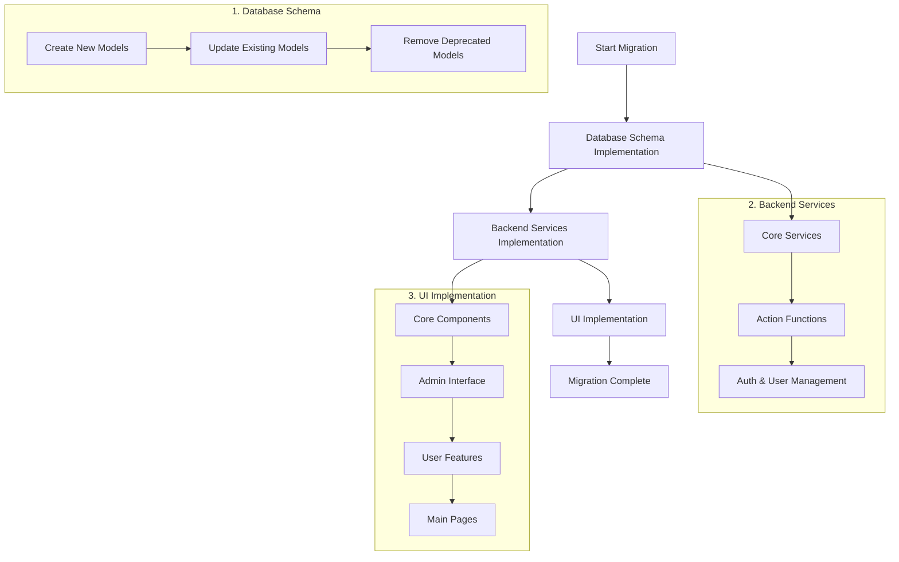
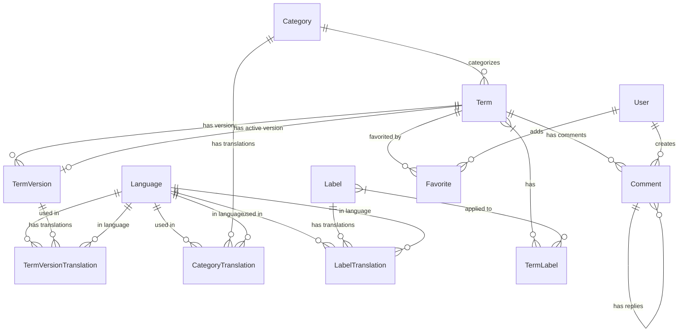

# Terminology System Migration Diagram

## High-Level Migration Flow



## Detailed Schema Changes



## Component Dependencies

```mermaid
flowchart TD
    subgraph "Data Models"
        Language
        Category
        CategoryTranslation
        Label
        LabelTranslation
        Term
        TermVersion
        TermVersionTranslation
        TermLabel
        User
        Comment
        Favorite
    end

    subgraph "Services"
        LanguageService --> Language
        CategoryService --> Category
        CategoryService --> CategoryTranslation
        LabelService --> Label
        LabelService --> LabelTranslation
        TermService --> Term
        TermService --> TermVersion
        TermService --> TermVersionTranslation
        TermService --> TermLabel
    end

    subgraph "Actions"
        TermActions --> TermService
        CommentActions --> Comment
        FavoriteActions --> Favorite
        UserPreferenceActions --> User
    end

    subgraph "UI Components"
        LanguageSelector --> LanguageService
        CategoryNavigator --> CategoryService
        LabelNavigator --> LabelService
        TermCard --> TermService
        TermCard --> LanguageService
        TermsDisplay --> TermCard
    end

    subgraph "Pages"
        HomePage --> TermsDisplay
        CategoryPage --> CategoryNavigator
        CategoryPage --> TermsDisplay
        AdminTermsPage --> TermActions
        AdminCategoriesPage --> CategoryService
        AdminLabelsPage --> LabelService
        ProfilePage --> UserPreferenceActions
    end